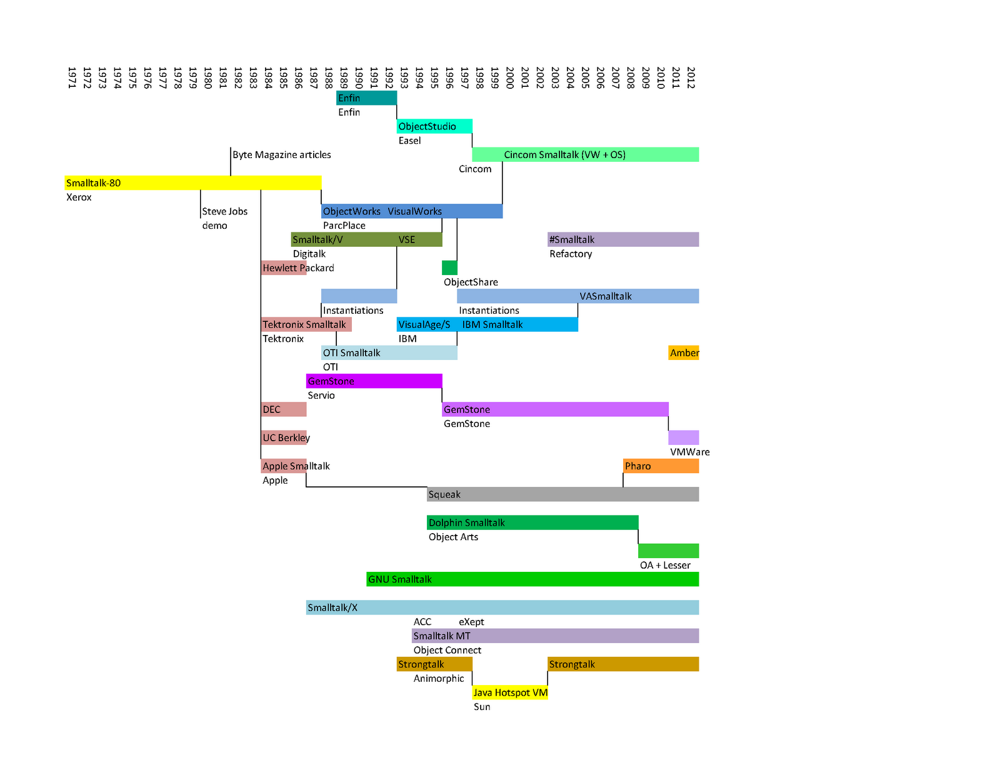

# SmalltalkSurvey

The goal is to compile a reasonably complete list of all implementations of the Smalltalk system.

While it is very common for a recent language to have a single, open source implementation thanks to the Internet and to the reduced kinds of computers now available, it used to be inevitable for interesting languages to have many different implementations. The most common reason was due to the language not being available on your computer, or only a very expensive commercial version being available. The languages themselves were simpler and didn't include much in terms of libraries, so the effort to implement from a written description was not too bad. These descriptions were often not complete, leaving the implementors to guess many details and to include their own ideas. While languages like Basic and Pascal split into many dialects, the Forth, Lisp and Smalltalk communities were specially prone to this.

This page tries to trace the many Smalltalk dialects created over the years. In theory the separation of the system into a virtual machine running an "image" file should have helped splits be less common than in other languages, but in practice commercial reasons and hardware limitations encouraged recreating the image from scratch in many different projects.

### What is Smalltalk?

A language will be considered to be a Smalltalk if

1. it is easy to type in an example from a Smalltalk-80 book while adapting it on the fly (not counting any differences in the libraries) or
2. if "smalltalk" is part of the project's name.

Rule 1 is very subjective. For some people it might be trivial to translate Smalltalk-80 into Objective-C or Javascript while typing at full speed, but many others would find it a bit complicated.

The reason for rule 2 is to allow an implementation's creators to decide. If they selected to include "smalltalk" in the name of their project then their intent should be respected. In the current version of the list below only Smalltalk-72 (and -74) and MIT's ConcurrentSmalltalk depend on this rule. It would be silly to exclude the very first Smalltalk even if it lacks many features that later became standard and the Lisp syntax of the MIT project is only a small issue given how the rest of the project adopts the traditional Smalltalk ideas.

### Type

"Paper" means that a description of the language was published without a corresponding implementation (at that time). "System" indicates that both a virtual machine and an image including libraries were implemented. "VM" means that a new virtual machine was created to run some existing image, while "image" indicates a new image and libraries running on a previously implemented virtual machine or an implemention on top of an existing system.

### License

"Open" means that the license is in the spirit of Open Source or Free Software (linking to the code repository). "Commercial" is closed software that was sold. "Internal" was not made available to the public at all. "No cost" was made available without payment but without the sources (the more proper term "freeware" would cause confusion with Free Software and so was avoided).

## Implementations:

Taken from [a draft Smalltalk history at Simberon](http://simberon.blogspot.com/2012/04/smalltalk-history-draft-2.html):

### Initial Release and Forks

| year | name and version    | type     | authors                       | license    | description |
|------|---------------------|----------|-------------------------------|------------|-------------|
| 2022 | PigeonTalk          | system   | David Buck                    |            | block based, like Scratch  |
| 2022 | Smalltalk-80-CompilerLib | compiler | Mark Bush                | [open](https://github.com/markbush/Smalltalk-80-CompilerLib) | Smalltalk compiler in Swift |
| 2021 | Zag                 | system   | David Mason                   | [open](https://github.com/dvmason/Zag-Smalltalk) | VM written in Zig |
| 2021 | JSqueak-2021        | VM       | Ricky                         | [open](https://github.com/ricky9090/jsqueak-2021) | fork of Squeak VM in Java |
| 2020 | Haver               | image    | Gerald Klix                   | open       | runs on Cuis and adds modules |
| 2020 | ST80                | VM       | devhawala                     | [open](https://github.com/devhawala/ST80)  | Smalltalk-80 VM in Java with interesting references |
| 2020 | Crosstalk           | VM       | Michael Engel                 | [open](https://github.com/michaelengel/crosstalk) | Smalltalk-80 VM in C++ for Raspberry Pi |
| 2020 | Smalltalk           | VM       | Dan Banay                     | [open](https://github.com/dbanay/Smalltalk) | translations of the "Blue Book" VM to C |
| 2020 | Smalltalk           | VM       | Rochus Keller                 | [open](https://github.com/rochus-keller/Smalltalk) | interpreter and other tools to explore the orignal Smalltalk-80 image |
| 2020 | Amiga-Smalltalk     | VM       | Graham Lee, Alan Francis      | [open](https://github.com/iamleeg/Amiga-Smalltalk) | "blue book" Smalltalk VM for the Amiga |
| 2020 | SmallJ              | VM       | Richard R                     | [open](https://github.com/smalljvm/SmallJ) | fork of SmallWorld |
| 2020 | Little Smalltalk-G  | system   | Gregor Richards               | [open](https://github.com/GregorR/lstg) | fork of Little Smalltalk 5 |
| 2019 | stvm                | VM       | Vincent Aranega               | [open](https://github.com/aranega/stvm) | Smalltalk VM in Python |
| 2019 | Smalltalk-72        | system   | Pablo Marx                    | [open](https://github.com/pablomarx/Smalltalk72) | Nova assembly and Smalltalk-72 sources) |
| 2019 | Mist                | system   | Braden Shepherdson            | [open](https://github.com/bshepherdson/mist) | micro Smalltalk with VM in Javascript |
| 2019 | ScarletSmallTalk    | compiler | Astares                       | [open](https://github.com/astares/ScarletSmallTalk) | translates Smalltalk to Javascript |
| 2019 | Rusttalk            | VM       | Chris Toshok                  | [open](https://github.com/toshok/rusttalk) | Smalltalk VM in Rust |
| 2019 | RST-Compiler        | compiler | Drakeor                       | [open](https://github.com/drakeor/RST-Compiler) | translates Smalltalk to x86 assembly, written in Rust |
| 2018 | GotalkInterpreter   | VM       | Michael Alastor, Alexander K  | [open](https://github.com/SealNTibbers/GotalkInterpreter) | simple Smalltalk interpreter in Golang |
| 2018 | CrankVM             | VM       | Ronie Salgado                 | [open](https://github.com/ronsaldo/crankvm) | minimal VM in C |
| 2018 | SmallBalloon        | system   | fwcd                          | [open](https://github.com/fwcd/smallballoon) | Smalltalk interpreter for Javascript |
| 2018 | Jupiter             | system   | David Arias                   | [open](https://github.com/davidarias/Jupiter) | language based on Smalltalk/Self |
| 2017 | TruffleSqueak       | VM       | Hasso PLattner Institut       | [open](https://github.com/hpi-swa/trufflesqueak) | uses Truffle and GraalVM |
| 2017 | lowtalk             | VM       | Ronie Salgado                 | [open](https://github.com/ronsaldo/lowtalk) | VMless metacircular implementation using Pharo |
| 2017 | Smoltok             | VM       | Matt Parsons                  | [open](https://github.com/parsonsmatt/smoltok) | Blue Book VM in Rust |
| 2016 | Crosstalk           | system   | Ken Dickey                    | [open](https://github.com/KenDickey/Crosstalk) | Smalltalk in Scheme |
| 2015 | SqueakJS            | VM       | Vanessa Freudenberg           | open       | VM for Squeak/Cuis/Pharo in Javascript |
| 2015 | Spry                | system   | Göran Krampe                  | [open](https://github.com/gokr/spry)       | very tiny but Smalltalk-like implemented in Nim |
| 2015 | smalltalk-vm        | VM       | Michal Balda                  | [open](https://github.com/mib/smalltalk-vm) | simple VM in C |
| 2015 | lodtalk             | system   | Ronie Salgado                 | [open](https://github.com/ronsaldo/lodtalk) | embeddable Smalltalk |
| 2015 | lst3r               | system   | Chris Reuter                  | [open](https://github.com/suetanvil/lst3r) | cleanup of Little Smalltalk 3 |
| 2015 | StNG                | VM       | Federico Omoto                | [open](https://github.com/FedeOmoto/stng) | Smalltalk Next Generation in Nim |
| 2015 | SmallTalk-VirtualMachine | VM  | Mayank Thirani                | [open](https://github.com/mthirani/SmallTalk-VirtualMachine) | generate and interpret Smalltalk bytecodes in Java |
| 2014 | Korz                | image    | David Ungar, Harold Ossher    | internal   | a subjective extensions of Self or Javascript |
| 2014 | Smalltalk 25        | system   | Boris Shingarov               |            | generate a VM from the definition of a processor |
| 2014 | Bee Smalltalk       | system   | Javier Pimás, Javier Burroni, Gerardo Richarte | open      | metacircular Smalltalk            |
| 2014 | Smalltalk78JS       | VM       | Vanessa Freudenberg           | [open](https://github.com/codefrau/Smalltalk78) | VM for Smalltalk-78 in Javascript |
| 2013 | Gravel              | system   | Wouter Gazendam               | [open](https://github.com/gravel-st/gravel) | Smalltalk implementation for the Java VM |
| 2013 | TruffleSOM          | VM       | Stefan Marr                   | [open](https://github.com/smarr/TruffleSOM) | SOM (Simple Object Machine) Smalltalk on Truffle |
| 2013 | YetAnotherSmalltalkVM | VM       | Ladislav Marek              | [open](https://github.com/lm/yet-another-smalltalk-vm) | Smalltalk VM in C with JIT |
| 2013 | TinyHiss            | system   | Darius Bacon                  | [open](https://github.com/darius/tinyhiss) | toy Smalltalk in Python |
| 2013 | st76                | VM       | dsmvwld                       | [open](https://github.com/dsmvwld/st76) | Smalltalk-76 in Java |
| 2013 | smalltalk           | system   | Stanislav Yaglo               | [open](https://github.com/yaglo/smalltalk) | Smalltalk on Objective-C runtime |
| 2012 | Tumbleweed          | system   | Paul Gregory                  | [open](https://github.com/pgregory/tumbleweed)   | fork of Little Smalltalk 3 |
| 2012 | Mist                | system   | Martin McClure                | open       | simple Smalltalk-in-Smalltalk that compiles to x86-64 |
| 2012 | LittleSmallscript   | system   | Minori Yamashita              | [open](https://github.com/ympbyc/LittleSmallscript) | translates Smalltalk into Javascript |
| 2012 | list                | VM       | Dmitry Kashitsyn              | [open](https://github.com/0x7CFE/llst)  | LLVM compiler for Little Smalltalk 5 |
| 2012 | Minitalk            | system   | Hellwig Geisse                | [open](https://github.com/GunterMueller/Minitalk) | experimental Smalltalk |
| 2011 | Amber Smalltalk     | system   | Nicolas Petton                | [open](https://github.com/amber-smalltalk/amber)      | runs on Javascript |
| 2011 | Redline Smalltalk   | system   | James Ladd, Sean Allen        | [open](https://github.com/redline-smalltalk/redline-smalltalk)       | runs on the Java VM |
| 2011 | Objective-Smalltalk | system   | Marcel Weiher                 | [open](https://github.com/mpw/Objective-Smalltalk) | combines features from Objective-C and Smalltalk |
| 2011 | Reak                | system   | Konstantin Haase              | [open](https://github.com/rkh/Reak) | Smalltalk on Rubinius |
| 2011 | A Little Smalltalk  | system   | Alain Fischer                 | [open](https://github.com/afi-lambda/a_little_smalltalk) | fork o Little Smalltalk 3 |
| 2010 | Sly                 | image    | David Ungar, Sam Adams        | open       | extends Squeak to implement ensembles and adverbs on the RoarVM |
| 2010 | Pinocchio           | system   | U of Berne                    | open       | meta-circular VM |
| 2010 | Irontalk            | system   | William Lahti                 | [open](https://github.com/rezonant/irontalk) | Smalltalk for .NET |
| 2010 | LittleTalk          | system   | Hugo Ferreira                 | [open](https://github.com/hugoferreira/LittleTalk) | minimalistic, self hosting Smalltalk |
| 2009 | Cuis 1.0            | image    | Juan Vuletich                 | [open](https://github.com/Cuis-Smalltalk/Cuis-Smalltalk-Dev)       | fork of Squeak 3.7 to make it simpler |
| 2009 | Pharo 0.1           | image    | Pharo Board                   | [open](https://github.com/pharo-project/pharo)       | fork of Squeak 3.9 to go in a different direction |
| 2009 | chitchat            | compiler | Stephen Weeks                 | [open](https://github.com/parrot/chitchat) | translates Smalltalk to Parrot VM (Perl) |
| 2008 | RoarVM              | VM       | David Ungar, Sam Adams        | [open](https://github.com/smarr/RoarVM) | a rewrite of the SqueakVM in C++ to run on manycore machines |
| 2008  | OpenSmalltalkVM    | VM       | Eliot Miranda                 | [open](https://github.com/OpenSmalltalk/opensmalltalk-vm) | fork of the SqueakVM to do JIT compilation and other enhancements |
| 2008 | Huemul              | system   | Guilleromo Adirán Molina      |            | uses Exupery to compile to x86 |
| 2008 | Panda               | system   | Vincent Geddes                | [open](https://github.com/vgeddes/panda-smalltalk) | Smalltalk implemented from scratch in C99 |
| 2008 | IronSmalltalk       | VM       | Erlis Vidal                   | [open](https://github.com/erlis/IronSmalltalk) | Smalltalk VM in C# |
| 2007 | RSqueak             | VM       | HPI-SWA                       | [open](https://github.com/hpi-swa/RSqueak) | VM for Squeak using the PyPy project |
| 2006 | JSqueak/Potato      | VM       | Dan Ingalls                   | [open](https://github.com/victorr/jsqueak) | VM for Squeak written in Java |
| 2005 | Parla               | system   | Michael Koehne                | open       | fork of Little Smalltalk 3 |
| 2004 | Susie               | system   | Montgomery Tidwell            | open       | (Scripting Using a Smalltalk Interpreter Engine) fork of PDST |
| 2002 | LST 4.5             | system   | Kyle Hayes                    | [open](https://github.com/kyle-github/littlesmalltalk) | fork of Little Smalltalk 4 |
| 2002 | SmallWorld          | VM       | Tim Budd                      | [open](https://github.com/crcx/littlesmalltalk)  | Little Smalltalk VM in Java |
| 2002 | ATalk               | system   | Jim Steichen                  | [open](http://www.frontiernet.net/~jimbot/amigatalk.htm) | (AmigaTalk) fork of Little Smalltalk 1 |
| 2002 | Jitter5             | VM       | Ian Piumarta                  | open       | JIT compiler for Squeak |
| 2002 | #Smalltalk          | system   | John Brant, Don Roberts       | open       | Smalltalk for .NET |
| 2002 | OOVM                | system   | Lars Bak                      | commercial | Smalltalk for embedded devices, with special block arguments |
| 2002 | Slate               | system   | Lee Salzman, Brian Rice       | [open](https://github.com/briantrice/slate-language)     | prototype based with multiple dispatch |
| 2002 | S#                  | system   | David Simmons                 | commercial | Smalltalk for .NET |
| 2002 | SOM                 | system   | U of Aarhus                   | open       | SimpleObjectMachine for teaching implementation techniques |
| 2001 | dSelf               | system   | Robert Tolksdorf, Kai Knubben |            |  distributed version of Self |
| 2001 | Klein               | VM       | David Ungar                   | open       | metacircular Self VM |
| 2001 | Self4Linux          | VM       | Gordon Cichon                 | open       | x86 JIT compiler for Self |
| 2001 | Jitter3             | VM       | Ian Piumarta                  | open       | JIT compiler for Squeak |
| 2001 | LSWVST              | system   | Lesser-Software               | commercial | bytecode compatible with Smalltalk/V |
| 2000 | Jitter2             | VM       | Ian Piumarta                  | open       | JIT compiler for Squeak 2.3 |
| 2000 | Bistro              | system   | Nik Boyd                      | open       | Smalltalk on top of the Java VM |
| 1999 | PDST                | system   | Douglas Hammond               | open       | (Public Domain Smalltalk) fork of Little Smalltalk 3 |
| 1999 | OpenSelf            | vm       | Marko Mikulicic               | [open](http://www.linuxsupportline.com/~openself/)  | rewrite of the Self VM from scratch |
| 1999 | JSelf               | VM       | Diego Deck                    | open       | Self VM in Java |
| 1999 | F-Script            | system   | Philippe Mougin               | open       | Smalltalk layer on top of Cocoa MacOS, with APL style extensions |
| 1999 | smalltalk           | system   | Richard Cornwell              | [open](https://github.com/rcornwell/smalltalk) | VM in C and Smalltalk sources |
| 1998 | Jitter1             | VM       | Ian Piumarta                  | open       | JIT compiler for Squeak 1.3 generating threaded code |
| 1998 | Dolphin             | system   | Object Arts                   | commercial | small system optimized for Windows |
| 1998 | Pocket Smalltlk     | system   | Andrew Brault                 | open       | develop in an IDE an generate executable for Palm Pilot |
| 1997 | tinySelf1           | VM       | Jecel Assumpção Jr            | open       | parallel Self VM written in Self |
| 1997 | ZokuTalk            | system   | Peter William Lount           | internal   | MOBS: Messages, Object, Blocks and Syntax |
| 1996 | Us                  | image    | David Ungar, Randy Smith      | internal   | a subjective extension of Self |
| 1996 | Squeak              | system   | Apple                         | open       | VM written in Slang (Smalltalk subset) and simulated within Smalltalk |
| 1996 | Strongtalk          | system   | Animorphic Systems            | commercial | vm techniques from Self, optional typing, traits |
| 1995 | Self/R              | paper    | Jecel Assumpção Jr            |            | reflective extension of Self |
| 1994 | Smalltalk MT        | system   | Tarik Kerroum                 | commercial | compiles Smalltalk to machine code with easy access to DLLs |
| 1994 | SmalltalkAgents     | system   | Quasar Knowledge Systems      | commercial | features optimized to access MacOS resources |
| 1993 | VisualAge           | system   | IBM                           | commercial | focus on IDE for various languages |
| 1991 | Ultimardrev         | VM       | Philippe Mulet, Fred Rivard   | open       | Self 1 interpreter in Smalltalk 2.5 |
| 1990 | GNU Smalltalk       | system   | Steve Byrne, Paolo Bonzini    | [open](https://github.com/bonzini/smalltalk) | text based |
| 1989 | Object Studio       | system   | ENFIN                         | commercial | originally called SCOPE, for military applications on the PC |
| 1988 | ConcurrentSmalltalk | hardware | MIT                           | internal   | Lisp syntax version of Smalltalk on the 1024 processor J-Machine |
| 1987 | VisualWorks         | system   | ParcPlace                     | commercial | spinoff from Xerox PARC to implement Smalltalk-80 for workstations (originally ObjectWorks) |
| 1987 | Mushroom            | hardware | U Manchester                  | internal   | multiple FPGAs and TTLs |
| 1987 | Self                | paper    | Dave Ungar, Randy Smith       |            | prototype based |
| 1986 | Smalltalk/X         | system   | Claus Gittinger               | internal   | Smalltalk to C translator, initially |
| 1986 | ConcurrentSmalltalk | system   | Yasuhiko Yokote, Mario Tokoro |            | implements "return and continue", mailboxes |
| 1986 | Swamp               | hardware | U Toronto                     | internal   | bitslice |
| 1986 | AI32                | hardware | Hitachi                       | internal   | chip |
| 1986 | Smalltalk V         | system   | Digitalk                      | commercial | graphic Smalltalk on DOS |
| 1986 | GemStone/S          | system   | Servio                        | commercial | integrated database and Smalltalk |
| 1985 | Methods             | system   | Digitalk                      | commercial | text GUI on the IBM PC |
| 1985 | Smalltalk-PC        | system   | Christopher Made              |            | implementation for the Apple II and other micros |
| 1984 | Sword32             | hardware | U Tokyo                       | internal   | chip |
| 1984 | COM                 | hardware | Caltech                       | internal   | Object architecture |
| 1984 | Little Smalltalk 1  | system   | Tim Budd                      | [open](https://github.com/crcx/littlesmalltalk) | text based for Unix machines with corresponding book |
| 1984 | Clone/Reduce        | VM       | Jecel Assumpção Jr            | internal   | An alternative execution model via copying ASTs at runtime |
| 1983 | SOAR                | hardware | Berkeley                      | internal   | Smalltalk On A RISC processor and software|
| 1981 | Smalltalk-80        | VM       | Tektronix                     | internal   | 68000 prototype |
| 1981 | Smalltalk-80        | VM       | Apple                         | internal   | Lisa |
| 1981 | Smalltalk-80        | VM       | DEC                           | internal   | 32 bit port to the VAX |
| 1981 | Smalltalk-80        | VM       | HP                            | internal   | VAX |
| 1981 | Smalltalk-80        | VM       | U Berkeley                    |            | VAX |
| 1981 | OPL 432             | system   | Scott Warren                  | commercial | port of Rosetta Smalltalk to Intel's iAPX432 system |
| 1981 | Rosetta Smalltalk   | system   | Scott Warren                  |            | for 8 bit microcomputers, shown at the Exidy booth at NCC'81 |
| 1980 | Smalltalk-76        | image    | PARC, Pablo Marx              | [open](https://github.com/pablomarx/Smalltalk76) | reformated sources from a 1980 dump of Smalltalk-76 | 
| 1980 | TinyTalk            | system   | PARC                          | internal   | 64KB adaptation of Smalltalk-76 |
| 1980 | Smalltalk-80        | system   | PARC                          | [open](https://github.com/pablomarx/AltoST80) | release to the world |
| 1978 | Smalltalk-78        | system   | PARC                          | internal   | Notetaker |
| 1976 | Smalltalk-76        | system   | PARC                          | internal   | bytecodes and inheritance |
| 1974 | Smalltalk-74        | system   | PARC                          | internal   | OOZE (object-oriented zoned environment) virtual memory system |
| 1972 | Smalltalk-72        | system   | PARC                          | internal   | first implementation |
| 1971 | Smalltalk-71        | paper    | PARC                          |            | initial ideas

### Further Major Releases

| year | name and version    | authors                       | license    | description |
|------|---------------------|-------------------------------|------------|-------------|
| 2022 | Squeak 6.0          | Squeak Board                  | open       | high resolution, uses SistaV1 bytecodes |
| 2022 | Cuis 6              | Juan Vuletich                 | open       | includes Morphic 3 |
| 2022 | VAST Platform 11.0.0| Instanciations                | commercial |             |
| 2022 | Pharo 10            | Pharo Board                   | open       |             |
| 2021 | VAST Platform 10.0.0| Instanciations                | commercial | renamed VA Smalltalk to VAST Platform |
| 2021 | Pharo 9             | Pharo Board                   | commercial |             |
| 2020 | ObjectStudio 9.0    | Cincom                        | commercial |             |
| 2020 | VisualWorks 9.0     | Cincom                        | commercial |             |
| 2020 | Pharo 8.0           | Pharo Board                   | open       |             |
| 2019 | Pharo 7.0           | Pharo Board                   | open       |             |
| 2017 | VA Smalltalk 9.0    | Instanciations                | commercial |             |
| 2017 | Pharo 6.0           | Pharo Board                   | open       |             |
| 2017 | Self 2017.1         | Russell Allen                 | open       |             |
| 2016 | Cuis 5.0            | Juan Vuletich                 | open       |             |
| 2016 | Dolphin 7           | Object Arts                   | [open](https://github.com/dolphinsmalltalk/Dolphin)       | open sourced the system |
| 2016 | Pharo 5.0           | Pharo Board                   | open       |             |
| 2015 | SmallWorld 2015     | Russel Allen, Davide Casa     | open       | update of the SmallWorld 2007 fork of SmallWorld |
| 2015 | Squeak 5.0          | Squeak Board                  | open       | introduced Spur memory model |
| 2015 | Pharo 4.0           | Pharo Board                   | open       |             |
| 2014 | Pharo 3.0           | Pharo Board                   | open       |             |
| 2014 | VisualWorks 8.0     | Cincom                        | commercial |             |
| 2013 | Pharo 2.0           | Pharo Board                   | open       |             |
| 2012 | Cuis 4.0            | Juan Vuletich                 | open       | better package support |
| 2011 | Cuis 3.0            | Juan Vuletich                 | open       | new look |
| 2010 | Cuis 2.0            | Juan Vuletich                 | open       | closure enabled, can used Co VM |
| 2010 | Self 4.4            | Russell Allen                 | open       | 
| 2009 | Pharo 1.0           | Pharo Board                   | open       |             |
| 2009 | VA Smalltalk 8.0    | Instanciations                | commercial |             |
| 2009 | Dolphin 6           | Object-Arts, Lesser Software  | commercial | moved Dolphin to LSWVST virtual machine |
| 2008 | Squeak 3.10         | Squeak Board                  | open       | first release after Pharo fork |
| 2008 | Self 4.3            | Russell Allen                 | [open](https://github.com/russellallen/self) | release of changes by David Ungar since 4.0 in 1995 |
| 2007 | SmallWorld 2007     | Russell Allen, Davide Casa    | [open](https://github.com/russellallen/SmallWorld) | continuation of SmallWorld, a VM for Little Smalltalk in Java |
| 2007 | Little Smalltalk 5  | Charles Childers              | open       |             |
| 2006 | Strongtalk          | Sun                           | open       | an open source release of the vm from the 1997 Strongtalk |
| 2005 | Little Smalltalk 4  | Tim Budd                      | open       | metaclasses, compiler in Smalltalk |
| 2005 | VA Smalltalk 6.0.2  | Instanciations                | commercial | transition from IBM VisualAge to VA Smalltalk |
| 2002 | Strongtalk          | Sun                           | open       | an open source release of the image from the 1997 Strongtalk |
| 2002 | VisualWorks 7.0     | Cincom                        | commercial |             |
| 2001 | Squeak 3.0          | Squeak Central                | open       | switched to Morphic as default GUI |
| 2000 | Squeak 2.0          | Squeak Central                | open       | pluggable views, Morphic |
| 1999 | VisualWorks 5i      | Cincom                        | commercial | uses native stack |
| 1998 | VisualWorks 3.0     | ObjectShare                   | commercial |             |
| 1996 | Smalltalk Express   | ObjectShare                   | no cost    | freeware version of Smalltalk V/Win |
| 1995 | Visual Smalltalk 3.0| Digitalk                      | commercial | client and Enterprise versions for OS/2 and Windows NT |
| 1995 | Self 4.0            | Sun Labs                      | open       | Morphic GUI |
| 1994 | Smalltalk/X         | eXept Software AG             | open       | moved from hobby to commercial development |
| 1994 | VisualWorks 3.0     | ParcPlace                     | commercial | enhanced database communication |
| 1993 | Self 3.0            | Sun Labs                      | open       | two compilers with type feedback |
| 1992 | Self 2.0            | Sun Labs                      | open       | improved compiler |
| 1991 | Smalltalk V/Win 3.0 | Digitalk                      | commercial |             |
| 1991 | Self 1.1            | Stanford                      | open       | threads and clean up |
| 1990 | Smalltalk/X         | Claus Gittinger               |            | added JIT compilation |
| 1990 | Self 1.0            | Stanford                      | open       | first implementation |
| 1988 | Smalltalk V/286     | Digitalk                      | commercial | protected mode system |
| 1988 | Smalltalk V 2.0     | Digitalk                      | commercial |             |
| 1988 | Smalltalk/X         | Claus Gittinger               | internal   | added bytecode interpreter |
| 1988 | Little Smalltalk 3  | Tim Budd                      | open       | reorganized source tree |
| 1987 | Little Smalltalk 2  | Tim Budd                      | open       | globals, more code moved to Smalltalk |
